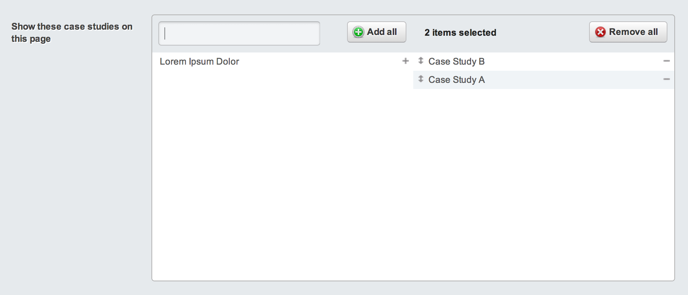

# MultiSelectField
[](https://travis-ci.org/kinglozzer/silverstripe-multiselectfield)

A drag & drop sortable select field for managing many-to-many relations.



## Installation:

### Composer:

```bash
$ composer require kinglozzer/multiselectfield:^2.0
```

### Download:

Simply clone or download this repository and put it in a folder called 'multiselectfield' in your SilverStripe installation folder, then run `dev/build`.

### Example:

The field currently only supports many-to-many relations. The constructor takes an optional argument for a field to sort on, which you need to define in your `$many_many_extraFields`.

The following is an example of how to use `MultiSelectField` in a simple many-to-many relationship with a "Sort" extra field:

```php
use Kinglozzer\MultiSelectField\Forms\MultiSelectField;

class Department extends DataObject
{
    private static $db = [
        'Name' => 'Varchar',
    ];

    private static $many_many = [
        'StaffMembers' => 'StaffMember',
    ];

    private static $many_many_extraFields = [
        'StaffMembers' => [
            'Sort' => 'Int',
        ]
    ];

    /**
     * @return FieldList
     */
    public function getCMSFields()
    {
        $fields = FieldList::create();

        $staffField = MultiSelectField::create('StaffMembers', 'Staff members', $this, 'Sort');
        $fields->addFieldToTab('Root.Main', $staffField);

        return $fields;
    }
}
```

```php
class StaffMember extends DataObject
{
    private static $db = [
        'Name' => 'Varchar',
    ];

    private static $many_many = [
        'Departments' => 'Department',
    ];
}
```
